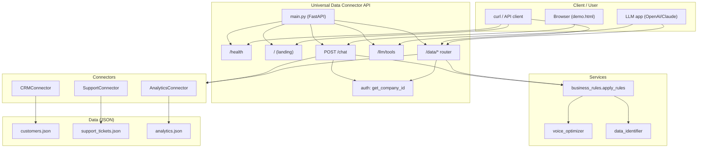
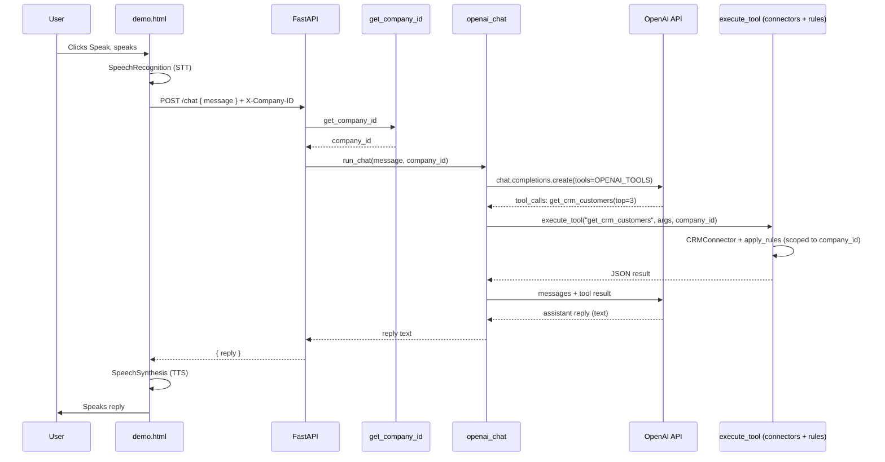
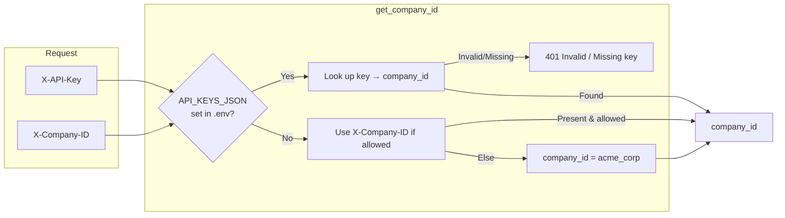
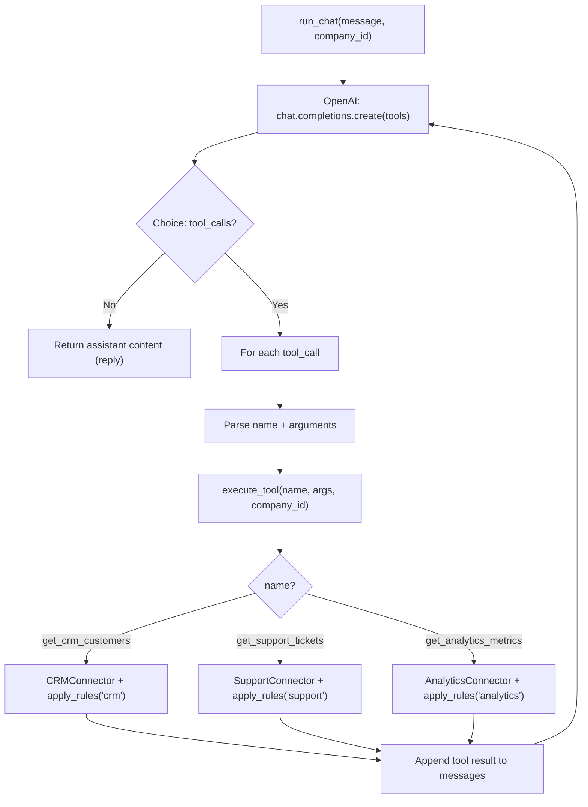
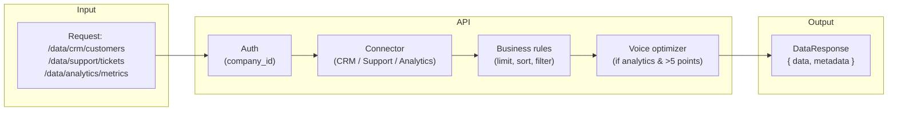

# Universal Data Connector — Detailed Overview & Flowcharts

## 1. What Was Done (Overview)

This project is a **production-style FastAPI backend** that exposes CRM, support tickets, and analytics through a **single API** with **LLM function-calling** support and **voice-optimized** responses. Below is a component-by-component summary, followed by flowcharts.

---

### 1.1 FastAPI Server & Infrastructure

- **Entry point:** `app/main.py` — FastAPI app with CORS, global exception handler, and a landing page at `GET /`.
- **Health:** `GET /health` returns `{"status": "healthy"}` for load balancers and monitoring.
- **Config:** `app/config.py` — Pydantic Settings; reads `.env` (HOST, PORT, MAX_RESULTS, OPENAI_API_KEY, API_KEYS_JSON).
- **Logging:** `app/utils/logging.py` — Structured logging (format, level); used at startup and in exception handler.
- **Docker:** `Dockerfile` (Python 3.11-slim, uvicorn) and `docker-compose.yml` for one-command run.

---

### 1.2 Data Connectors (3 Types)

Each connector implements `BaseConnector.get_data(params)` and reads from JSON under `data/`.

| Connector | File | Data source | Main params | Role |
|-----------|------|-------------|-------------|------|
| **CRM** | `app/connectors/crm_connector.py` | `data/customers.json` | customer_id, top, period | Customers by revenue; period = week/month/all |
| **Support** | `app/connectors/support_connector.py` | `data/support_tickets.json` | customer_id, status, priority | Tickets; filter by status (open/closed), priority |
| **Analytics** | `app/connectors/analytics_connector.py` | `data/analytics.json` | customer_id, from, to, limit | Time-series metrics; date range, last N points |

Connectors return **raw lists**; no limit/sort there — that is done in the **business rules** layer.

---

### 1.3 Business Rules Engine

- **File:** `app/services/business_rules.py`
- **Entry:** `apply_rules(data_type, raw_data, params)` → returns `DataResponse` (data + metadata).

**Per–data-type rules:**

- **CRM:** Filter by `customer_id` and `period` (week = 7 days, month = 30 days); sort by **revenue DESC**; **limit = min(top, 10)**; metadata: total_results, returned_results, data_freshness = "2 hours ago".
- **Support:** Sort by **created_at DESC**; **limit** (default 10, max 50); same metadata.
- **Analytics:** If >5 points, **voice_optimizer** returns a **summary** (total, avg, trend); metadata includes **data_type = "time-series"**.

**Voice-oriented behaviour:** Limits (e.g. max 10 for CRM), “showing X of Y” in metadata, and summarization for analytics so answers are short for voice.

---

### 1.4 Voice Optimizer & Data Type Detection

- **Voice optimizer** (`app/services/voice_optimizer.py`):  
  - `summarize_if_large(data)` — truncates to MAX_RESULTS and can replace with a short summary message.  
  - `summarize_analytics(data)` — for analytics with many points: one summary object (total, avg, trend %) for TTS-friendly answers.
- **Data identifier** (`app/services/data_identifier.py`): `identify_data_type(data)` — classifies as time_series, tabular_support, tabular_crm, etc., from keys (e.g. date, ticket_id, customer_id).

---

### 1.5 LLM Function-Calling Interface

- **Tool schemas:** `app/schemas/llm_tools.py` — defines **OpenAI** and **Anthropic** tool formats (name, description, parameters/input_schema) for:
  - `get_crm_customers` (customer_id, top, period)
  - `get_support_tickets` (customer_id, status, priority, limit)
  - `get_analytics_metrics` (customer_id, from, to, limit)
- **Endpoints:**
  - `GET /llm/tools?format=openai|anthropic` — returns tool list for the chosen provider.
  - `GET /llm/tools/endpoints` — returns mapping tool name → HTTP method + path.
- **OpenAPI:** FastAPI exposes `/openapi.json` and `/docs`; parameters are validated and documented.

---

### 1.6 Chat (OpenAI + Tools In-Process)

- **Route:** `POST /chat` — body `{"message": "..."}`; optional headers: `X-Company-ID`, `X-API-Key`.
- **Service:** `app/services/openai_chat.py`
  - `run_chat(user_message, company_id)` calls OpenAI (gpt-4o-mini) with the tool definitions.
  - When the model returns **tool_calls**, the backend **executes them in-process** (same connectors + business_rules), then sends results back to OpenAI until the model replies with plain text.
- **Company scoping:** `company_id` from auth is injected into every tool execution so the LLM only “sees” that tenant’s data.

---

### 1.7 Authentication / Company Selection (Tenant Scoping)

- **File:** `app/auth.py` — dependency `get_company_id(X-API-Key, X-Company-ID)`.
- **Behaviour:**
  - If **API_KEYS_JSON** is set in `.env`: **X-API-Key** is required; key maps to `company_id`; invalid/missing → 401.
  - If not set: **X-Company-ID** is optional (acme_corp, beta_inc, gamma_ltd, etc.); default `acme_corp`.
- **Usage:** All data routes and `POST /chat` use `company_id` so responses are scoped to that company (e.g. CRM/support/analytics filtered by that customer_id).

---

### 1.8 Data Models

- **Common:** `app/models/common.py` — `Metadata` (total_results, returned_results, data_freshness, optional data_type), `DataResponse(data, metadata)`.
- **Domain:** `app/models/crm.py`, `support.py`, `analytics.py` — Pydantic models for a single CRM record, support ticket, and analytics metric (used for typing/documentation; API responses stay generic where needed).

---

### 1.9 Mock Data & Tests

- **Mock data:** `app/utils/mock_data.py` — generators for customers, support_tickets, analytics; run as `python -m app.utils.mock_data` to (re)generate `data/*.json`.
- **Tests:**
  - `tests/test_connectors.py` — connector `get_data` and filtering.
  - `tests/test_business_rules.py` — apply_rules for crm/support/analytics and voice limits.
  - `tests/test_api.py` — health, root, openapi, data endpoints, LLM tools.
  - `tests/test_crm.py` — CRM customers limit and filter edge cases.
  - `tests/test_llm.py` — LLM tools endpoint (OpenAI/Anthropic format, endpoints mapping).

---

### 1.10 Voice Demo (Browser)

- **File:** `demo.html` — Web Speech API (STT) → user speaks → transcript sent to `POST /chat` with **X-Company-ID** (and optional **X-API-Key**) → reply spoken via SpeechSynthesis (TTS).
- **Script:** `start_demo.sh` — starts uvicorn + a small HTTP server for the demo page and opens the browser.

---

## 2. Flowcharts (Mermaid)

Copy the blocks below into any Mermaid-capable viewer (e.g. GitHub, [mermaid.live](https://mermaid.live)) to render the diagrams.

---

### 2.1 High-Level System Architecture



---

### 2.2 Data Request Flow (e.g. GET /data/crm/customers)

```mermaid
sequenceDiagram
    participant C as Client
    participant R as Data Router
    participant A as Auth
    participant BR as Business Rules
    participant Conn as CRMConnector
    participant JSON as customers.json

    C->>R: GET /data/crm/customers?top=3
    R->>A: get_company_id(X-Company-ID / X-API-Key)
    A-->>R: company_id
    R->>Conn: get_data({customer_id: company_id, top: 3, period: "all"})
    Conn->>JSON: read file
    JSON-->>Conn: raw list
    Conn-->>R: raw_data (filtered by connector if needed)
    R->>BR: apply_rules("crm", raw_data, params)
    BR->>BR: filter by customer_id, period; sort revenue DESC; limit min(top,10)
    BR-->>R: DataResponse(data, metadata)
    R-->>C: 200 { data, metadata: { total_results, returned_results, data_freshness } }
```

---

### 2.3 Voice Chat Flow (Browser → POST /chat → TTS)



---

### 2.4 Authentication / Company Selection Flow



---

### 2.5 Chat Tool-Execution Loop (In-Process)



---

### 2.6 End-to-End Data Path (All Three Sources)



---

This document and the flowcharts give a detailed overview of what was implemented and how the pieces connect end to end.
